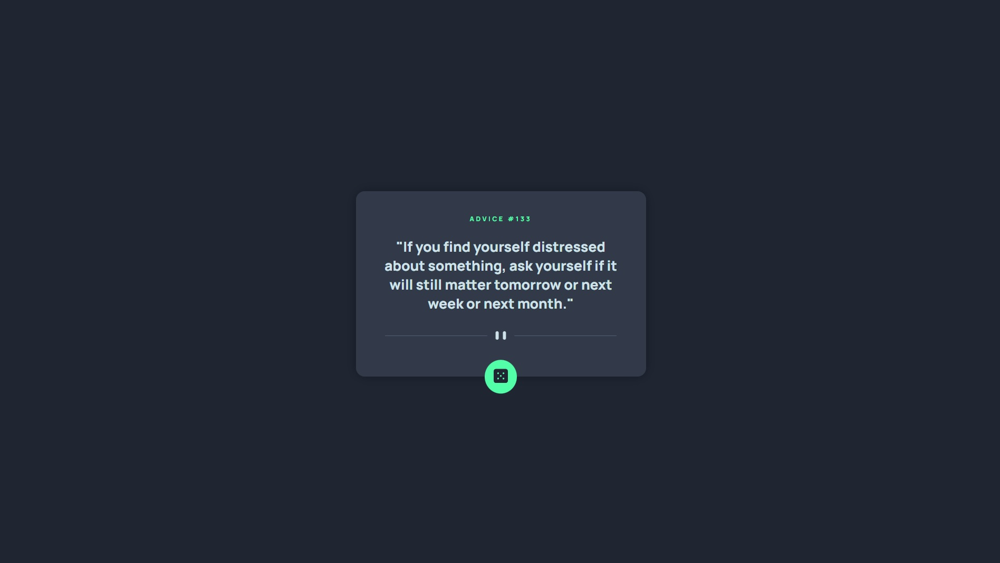

# Frontend Mentor - Advice generator app solution

This is a solution to the [Advice generator app challenge on Frontend Mentor](https://www.frontendmentor.io/challenges/advice-generator-app-QdUG-13db).

## Table of contents

- [Overview](#overview)
  - [The challenge](#the-challenge)
  - [Screenshot](#screenshot)
  - [Links](#links)
- [My process](#my-process)
  - [Built with](#built-with)
  - [What I learned](#what-i-learned)
- [Author](#author)

## Overview

### The challenge

Users should be able to:

- View the optimal layout for the app depending on their device's screen size
- See hover states for all interactive elements on the page
- Generate a new piece of advice by clicking the dice icon

### Screenshot



### Links

- Solution URL: [https://github.com/lidiakrajewska/advice-generator-app-main](https://github.com/lidiakrajewska/advice-generator-app-main)
- Live Site URL: [https://lidiakrajewska.github.io/advice-generator-app-main/](https://lidiakrajewska.github.io/advice-generator-app-main/)

## My process

### Built with

- Semantic HTML5 markup
- SASS
- Flexbox
- Mobile-first workflow
- JavaScript
- Advice Slip JSON API

### What I learned

You can select an image in CSS and change its url

```css
content: url("./images/pattern-divider-desktop.svg");
```

## Author

- Frontend Mentor - [@lidiakrajewska](https://www.frontendmentor.io/profile/lidiakrajewska)
- LinkedIn - [Lidia Krajewska](https://www.linkedin.com/in/lidia-krajewska-02512a1a7/)
